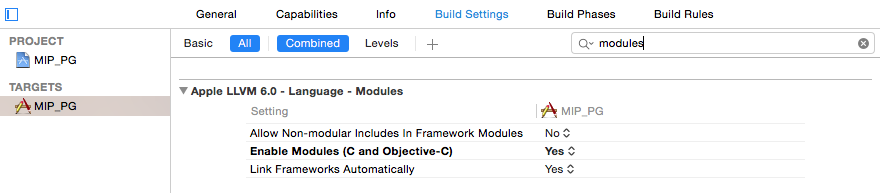
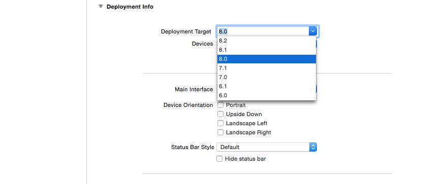
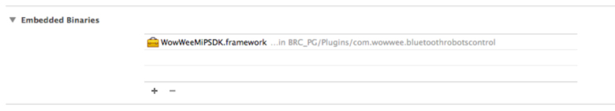

WowWee MiP PhoneGap SDK
================================

The free MiP PhoneGap SDK lets you control your [WowWee MiP robot](http://www.meetmip.com) on iOS and Android devices with Bluetooth Low Energy chipsets. To use this SDK you will also need a physical MiP robot.

A list of devices we expect to be compatible is listed [on our website](http://www.wowwee.com/mip/compatibility).

There is also an [Android SDK](https://github.com/WowWeeLabs/MiP-Android-SDK) and [iOS SDK](https://github.com/WowWeeLabs/MiP-iOS-SDK)  version available.

For information on WowWee products visit: <http://www.wowwee.com>

Table of Contents
---------------------------------------

- [Quick Installation](#)
	- [Android](#quick-installation---android)
	- [iOS](#quick-installation---ios)
- [Notes about the SDK](#notes-about-the-sdk)
- [License](#license)
- [Contributing](#contributing)
- [Projects using this SDK](#projects-using-this-sdk)

Quick Installation - Android
---------------------------------

1. Clone the repository or [download the zip](https://github.com/WowWeeLabs/MiP-PhoneGap-SDK/archive/master.zip).

		git clone https://github.com/WowWeeLabs/MiP-PhoneGap-SDK.git

	Depending on your setup and whether you are using Eclipse or Android Studio, the instructions will be slightly different however the library should work well with both. We have provided sample projects to get you started for both systems under the SampleProjects directory.

2. Install Cordova through npm

		npm install -g cordova

3. Create the cordova project

	cordova create WW_Mip_Phonegap com.wowwee.mpip.phonegap MIP_PG

4. Add android platform

		cd MiP-PhoneGap-SDK/phonegap/WW_BluetoothRobotControlLib_phonegap
		cordova platform add android

5. Add Mip Cordova plugin

		 plugin add ../com.wowwee.bluetoothrobotscontrol/

6. Copy the example file

		rm -rf www
		mkdir www
		cp -rf plugins/com.wowwee.bluetoothrobotscontrol/example/www

7. Config the app for landscape, add the line with widget on config.xml

		<perference name=“orientation” value=“landscape” />

8. Build and run

		cordova build android
		cordova run android

Quick Installation - iOS
---------------------------------

Clone the repository or [download the zip](https://github.com/WowWeeLabs/MiP-PhoneGap-SDK/archive/master.zip).

		git clone https://github.com/WowWeeLabs/MiP-PhoneGap-SDK.git

	Depending on your setup and whether you are using Eclipse or Android Studio, the instructions will be slightly different however the library should work well with both. We have provided sample projects to get you started for both systems under the SampleProjects directory.

Install Cordova through npm

		npm install -g cordova

Change directory and create the cordova project

		cd MiP-PhoneGap-SDK/phonegap/WW_BluetoothRobotControlLib_phonegap
		cordova create WW_Mip_Phonegap com.wowwee.mpip.phonegap MIP_PG

Add iOS platform

		cd WW_Mip_Phonegap
		cordova platform add ios

Add Mip Cordova plugin

		cordova plugin add ../com.wowwee.bluetoothrobotscontrol/

Copy the example file

		rm -rf www
		mkdir www
		cp -rf plugins/com.wowwee.bluetoothrobotscontrol/example/ www

Config the app for landscape, add the line with widget on config.xml

		<perference name=“orientation” value=“landscape” />

Open xCode projects "platforms/ios/MIP_PG.xcodeproj"

Enable Modules (C and Objective C) in Build Settings

Change Deployment Target to 8.0 in General

Add the framework "WowWeeMiPSDK.framework" to Embeded Binaries

Build and run

		cordova build ios
		cordova run ios

Notes about the SDK
---------------------------------

### Simulator Support

Our SDK cannot be used in the built in Android simulator due to lack of Bluetooth Low Energy support. Third party alternatives may work if they support the official BLE APIs.

### Android Gear Support

At present we havn't added support for Android gear. Third party support is welcome, please add an issue in the bug tracker.

### Full Source Code

At this stage we do not plan on releasing our full library source code.

### Are there any restrictions on releasing my own application?

The SDK is currently and will always be free for you to build and release your own applications. Your welcome to charge money or release free applications using our SDK without restrictions.

If you create a great application, all we ask is that you provide a link for people to purchase their own MiP so they can enjoy your product.

### Can I use your cool joystick code?

Yes we have provided the source code in our sample project, feel free to use this or make changes as you want. We would love pull requests.

### Can I create other platform versions of the SDK?

The lower level BLE command protocol is available in our [MiP-BLE-Protocol](http://github.com/WowWeeLabs/MiP-BLE-Protocol) repository, please post any other platform questions there.

License
---------------------------------
MiP Android SDK is available under the Apache License, Version 2.0 license. See the [LICENSE.txt](https://raw.githubusercontent.com/WowWeeLabs/MiP-Android-SDK/master/LICENSE.md) file for more info.

You are free to use our SDK in your own projects whether free or paid. There are no restrictions on releasing into Google Play or other stores. We do ask that you clearly differentiate your app from the official app so that users do not get confused.

Contributing
---------------------------------
We happily accept any pull requests and monitor issues on GitHub regularly. Please feel free to give us your suggestions or enhancements. Please note that due to resource constraints we most likely cannot add new features to the MiP robot himself, but we will certainly consider them for inclusion to future robots/versions.

Tell your friends, fork our project, buy our robot and share with us your own projects! These are the best kinds of positive feedback to us.

Projects using this SDK
---------------------------------
* [WowWee MiP Official App](https://play.google.com/store/apps/details?id=com.wowwee.mip&hl=en)
* Send us a pull request to add your app here
